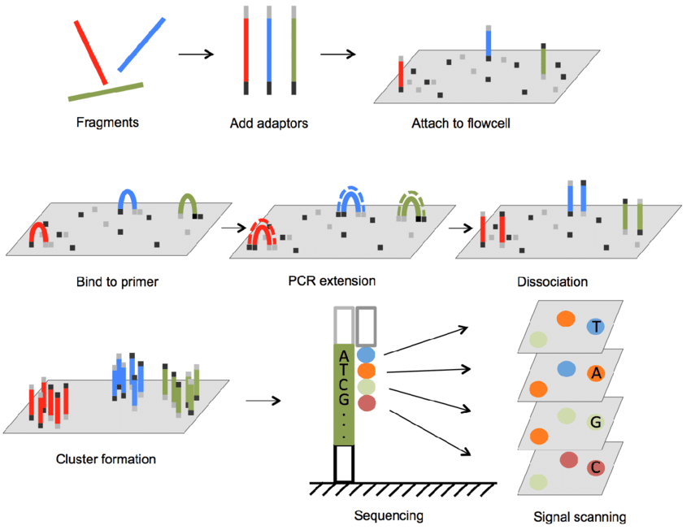

.. _Library_preparation-page:

******************************
2 Main Sequencing Technologies
******************************

Short Reads sequencing (Illumina)
=================================

It consist in The  polymerase-mediated Sequencing by synthesis (SBS), this works by coupling the four DNA bases to fluorescent markers alongside a terminator chemical group that pauses DNA synthesis.
While DNA is being synthesized, each fluorescent marker is optically verified before the tag and terminator are removed, and the next step in the sequence is recorded. 

#. Cluster generation

Adapter attached to the DNA fragment is used to hybridisation to the flowcell, subsequentlty PCR amplification (bridge amplification) generates a cluster of the same sequence fragment to amplify the signal
when the nucleotide base is synthesized, thus obtaining a multiple cluster on a Flow Cell. 

*Source: https://www.researchgate.net/publication/357946568_New_approaches_and_concepts_to_study_complex_microbial_communities*

#. Sequencing

On each cycle is incorporated one nucleotide to the template, it correspond to the read length (1'' cycles equal to 100 bp read length). 
After imaging to determine which of the four colours was incorporated in each cluster of the flow cell. 

Single end 
----------

Correspond to the basis of SBS, where the nucleotides added to the template sequence is read from one end of the fragment. 
It's more simple and effcient, due to reduce the the number of stemps in the library preparation.

nevertheless, the quality of nucleotides decreases as the sequencing process progresses.

Paired end
----------

*source: https://systemsbiology.columbia.edu/genome-sequencing-defining-your-experiment#:~:text=Single%2Dend%20vs.&text=In%20single%2Dend%20reading%2C%20the,opposite%20end%20of%20the%20fragment.*

During library preparation  are incorporated sequencing primers binding site at both ends of the DNA fragments. 
This allows to reading at one read, when it finiches this direction at the specified read lenght, then starts another round od reading from the opposite end of the fragemnt. 
It improves:

- The confidence of the sequence read
- The ability to identify the relative positions of various reads in the genome (much more efficient in resolve rearrangements such as insertions, deletions or inversions)
- Can improve the assembly of repetitive regions. 
- On the ohter hand is more expensive and time-consuming (respect single end)

.. seealso::
	.. _Illumina_sequencing_by_synthesis_workflow: https://www.youtube.com/watch?v=fCd6B5HRaZ8
	   
	   See the _Illumina_sequencing_by_synthesis_workflow video by Illumina to visualize the concepts of SBS. 

For more information 

Long read sequencing (Nanopore)
========================
